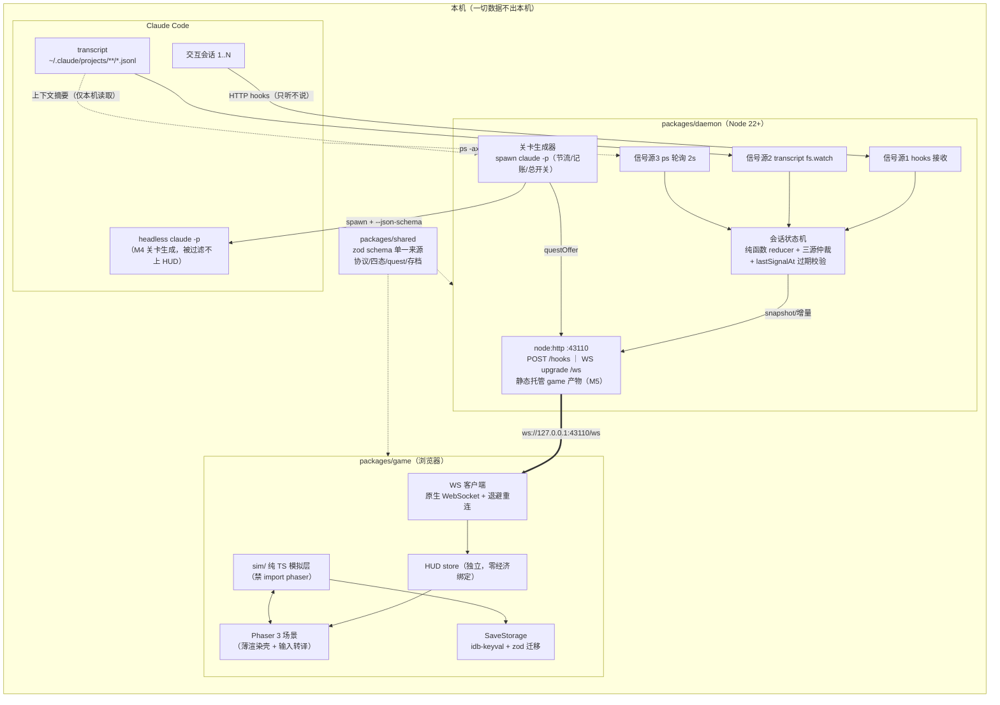

# Codestead 技术选型定稿

> 定稿日期：2026-06-10。本文档是对「稳妥派」「挑战派」两套候选方案的逐项裁决结果，调研依据见 `docs/design/research/` 下 engine / daemon / hooks / assets / mechanics 五篇纪要（版本号均为当日实查）。
>
> **裁决总原则**（按 CLAUDE.md 设计原则优先级展开）：
> 1. **游戏第一** → M1 的任务是把可玩性立起来，不是验证新渲染器/新构建内核；
> 2. **AI 结对开发是本项目第一工程现实** → 训练语料最充足、生态验证最久的版本优先；
> 3. **退路不对称性** → 凡「晚升级代价低、早采用风险即刻发生」的，一律先稳后升，并写明升级触发器；
> 4. **开源产品标准** → 依赖面最小、可审计、安装零摩擦；
> 5. 挑战派的**实质性技术修正**（非单纯版本激进）逐条采纳。

---

## 1. 决策总表

| 领域 | 最终选择与版本 | 核心理由 | 落选方案与原因 |
|---|---|---|---|
| 游戏引擎 | **Phaser 3**，`phaser@3.90.0`（精确锁定，v3 官方终版） | 即 CLAUDE.md 蓝图；AI 语料几乎全在 v3（十余年教程、4000+ 示例）；终版 bug 面固定且被社区踏勘透；grid-engine 2.48.2 等插件 peer 锁 v3；官方确认 v3→v4 迁移成本极小——**晚升级近零损失，早采用风险全额计入 M1**；M1~M3 体量（约 100×100 瓦片、数千精灵）远在 v3 性能包线内 | **Phaser 4.1.0**（engine.md 推荐）：TilemapGPULayer/SpriteGPULayer 的收益在 M1~M3 兑现不了，而从零重写的渲染器发布仅 2 个月、回归风险与插件适配空窗精确落在 M1 关键期 → 记为升级触发器（见 §7）。Excalibur（pre-1.0，API 漂移与 M5 冲突）、KAPLAY（无官方 Tiled 支持）、PixiJS 自研（违背游戏第一） |
| 语言 | **TypeScript** `~5.9.3`，全仓 `strict: true`；shared 包加开 `exactOptionalPropertyTypes` | 5.9 线被 typescript-eslint、Vite、Phaser 类型全生态长期验证 | **TS 6.0.3**：稳定仅约 2 个月，无 M1~M3 必需特性，升级留到 M3 后；tsgo（TS7 dev 标签）不采用，但项目结构（project references、无 paths 魔法）保持对其友好 |
| 构建（game） | **Vite** `^7.3.5` | Phaser 项目事实标准（官方模板即 phaser+vite）；7.x 活跃维护；Vitest 4 同时支持 ^7/^8，升级通道畅通 | **Vite 8**（Rolldown 内核）：大版本更替仅 3 个月，游戏构建无任何只有 8 才满足的需求 → M3 后小步升级 |
| 构建（daemon/shared） | 开发 **tsx** `^4.22.4`（watch 直跑），产物 **tsc** 编译 ESM，不引打包器 | 长驻 Node 进程不需要打包；tsc 产物最透明、调试栈帧最干净、可审计 | tsup（维护模式）/ tsdown（0.x 不稳定）：M5 若需 `npx codestead` 单文件分发体验再评估，现在不引 |
| monorepo | **pnpm workspaces**，`pnpm@10.34.1`（`packageManager` 精确锁定），不引任务编排器 | 蓝图项；3 个包、依赖一条直线（shared ← game/daemon），`pnpm -r --filter` + `tsc -b` project references 足够 | **pnpm 11**（发布仅 6 周，lockfile 大版本迁移无必要）；Turborepo/Nx（远程缓存对单人本地仓库是纯负担，包多于 6 个再评估） |
| Node 基线 | engines `">=22.13.0"`；本地 22 LTS "Jod" 或 24 LTS "Krypton"，CI 双跑 | 同时满足 Vite 7 / ESLint 10 engines；22 维护至 2027-04 | **Bun**（认真挑战后否决：目标用户本机必有 Node，Bun 要求额外装运行时直接伤害 M5 安装体验；child_process 长期 spawn 的边角行为 Node 最经考验）；Deno 同理 |
| 地图编辑器与格式 | **Tiled 1.12.2** + **.tmj**（Tiled JSON）；导出约定：tileset 嵌入地图、图层 CSV 不压缩、关闭 infinite、仅正交、16×16 | Phaser+Tiled 是十年验证的黄金组合，`load.tilemapTiledJSON()` 零自研解析；约定封死 Phaser 3 解析能力之外的特性 | **LDtk**：最后 release 距今近两年半、Phaser 无一方 loader——半休眠工具对开源产品是负资产 |
| 游戏状态管理 | **不引状态库**：`game/src/sim/` 纯 TS 模拟层（零 Phaser 依赖、确定性 tick），Phaser 场景只做渲染与输入转译；事件用 `Phaser.Events.EventEmitter`；HUD 是独立小 store（与农场经济完全隔离） | 模拟核心可在 Node 里 headless 跑「快进 30 天」测试——mechanics.md 数值自检清单直接代码化；AI 改数值不碰渲染；分层纪律由 ESLint `no-restricted-imports`（`sim/**` 禁 import phaser）强制 | zustand/vanilla（~1KB 但非必需，自写订阅原语 30 行即可）；Redux/mobx（React 生态错配）；ECS/bitECS（作物是格子数据非海量自治实体）；XState（无层级状态图需求） |
| 存档 | **IndexedDB** via `idb-keyval@^6.2.5`；单版本化 JSON 文档 `{ schemaVersion, ... }`；zod `safeParse` 校验 + 顺序迁移函数；日结算自动存 + 手动存；JSON 导出/导入兜底；`navigator.storage.persist()` 申请持久化 | 只需 get/set 一个 blob，idb-keyval（<1KB）是最小匹配；存储收敛到 `SaveStorage` 接口后，未来换 daemon 落盘/桌面化只动一个模块 | localStorage（同步阻塞、~5MB 上限）；idb（功能多于所需）；Dexie（能力过剩） |
| WebSocket | 服务端 **`ws@^8.21.0`**；游戏端**浏览器原生 WebSocket** + 自写指数退避重连（约 30 行） | ws 零运行时依赖、Node 服务端事实标准；Node 原生 WebSocket 仅客户端无服务端实现 | socket.io（长轮询降级/房间在 localhost 全用不上，私有协议绑死客户端）；bufferutil 等可选原生加速不装（跨平台编译摩擦） |
| 共享协议 | **`packages/shared` = zod `^4.4.3` 单一事实源**：消息、四态枚举、quest、存档 schema 全部 zod 定义，TS 类型 `z.infer` 导出；跨边界数据（hook body、WS 消息、CLI 返回）一律 `safeParse` | daemon 与 game 是两个运行时，运行时校验不可省；一份 schema 同时产出 TS 类型、运行时校验、headless Claude 的 `--json-schema`（`z.toJSONSchema`），三处同源 | protobuf/msgpack（localhost 几 KB 文本消息，二进制零收益伤可调试性）；tRPC/ts-rest（这是单向状态推送非 RPC）；TypeBox/ArkType/valibot（能力相当但 AI 语料不及 zod） |
| 会话检测 | **三源仲裁**：hooks（HTTP hook 主路）> transcript `fs.watch` > ps 轮询（2s）；**手写纯函数 reducer 状态机**，每会话 `lastSignalAt` 过期校验，迁移幂等 | hooks 给语义、transcript 纠 Esc 中断盲区、ps 负责发现未装 hooks 会话与崩溃收尸；难点是多源仲裁与 staleness，纯 reducer + 表驱动测试最小最可测 | XState v5（错配）；ps-list（其 `name` 15 字符截断正是要绕开的坑，自己 spawn `ps -axo` 约 30 行 + 单测）；herdr 式屏幕分析（启发式误判多，仅借鉴其显式 `unknown` 态与四态模型） |
| headless Claude | `claude -p`（**不用 `--bare`**）+ `--settings '{"disableAllHooks": true}'` + `--strict-mcp-config` + `--output-format json --json-schema` + `--max-turns 4 --max-budget-usd 0.20 --no-session-persistence --allowedTools "Read"`；daemon 自管 90s SIGTERM → 5s SIGKILL | **采纳挑战派修正**：`--bare` 跳过 OAuth/keychain、强制要 `ANTHROPIC_API_KEY`，对订阅用户（目标人群主体）是安装体验杀手；`disableAllHooks` 防止关卡生成会话反向触发自家 hooks 造成自激回环，`--strict-mcp-config` 保证环境干净 | `--bare`（稳妥派原案，认证问题致命）；Agent SDK 0.3.x（不稳定、独立依赖、06-15 后无成本优势，spawn 用户 CLI 让版本与认证随用户走） |
| 测试 | **Vitest** `^4.1.8` + `@vitest/coverage-v8`，根级 projects 模式统一三包 | 与 Vite 同生态零配置、ESM 原生；测试资产三类：sim 层「快进 N 天」经济/生长测试、daemon 状态机录制事件流回放、shared schema 兼容测试；渲染层不写单测 | Jest（ESM 体验差）；Bun test（绑运行时）；node:test（生态弱）；Playwright E2E 推迟到 M5 做冒烟级 |
| Lint/Format | **ESLint** `^10.4.1`（flat config）+ **typescript-eslint** `^8.61.0`（`recommendedTypeChecked`）+ **Prettier** `^3.8.4`；根级单一 `eslint.config.js` 按包差异化；husky + lint-staged 轻量 pre-commit | 类型感知规则是核心价值：daemon 异步代码的 `no-floating-promises`、sim 层架构边界 `no-restricted-imports` 都是 load-bearing 规则；AI 语料与社区约定最充足 | **Biome**（单工具更快，但 type-aware 规则缺失正是本项目最需要的部分；规则需求若变再评估）；oxlint（仍需配 Prettier，未消除双工具） |
| CI | **GitHub Actions**，矩阵分期：**M1 期间收敛为 `ubuntu-latest × Node 22` 单 job**（frozen-lockfile → typecheck → lint+format check → test → build）；**macOS 与 Node 24 自 M2 daemon 代码落地起加入矩阵**（与「M2 第一周事件录制器」同步） | M1 无 daemon 代码，macOS/多 Node 是纯开销；M2 起 macOS 不是可选项——daemon 的 ps/tty/路径行为平台敏感，正是核心可靠性面；测 22 是因为它是 engines 下限 | Windows（M5 前补位项，README 标注支持矩阵）；changesets 留到 M5 发包时引入 |
| 美术/音频 | **Kenney CC0**（Roguelike/RPG pack + Tiny Town，16×16）+ Kenney Audio + FreePD 镜像 BGM；**许可白名单 = CC0-1.0 + OFL-1.1（OFL 仅限 Fusion Pixel 字体，仓库附 OFL 许可全文）**；除该字体外，其余资产仅 CC0 进仓库，`assets/manifest.json` 逐文件追溯 | 唯一可无顾虑 commit 进公开仓库的体系，零署名义务、安装零摩擦；白名单显式收录 OFL 字体例外，消除许可门禁按「仅 CC0」字面实现时拦掉字体的矛盾 | Sprout Lands / Sunnyside / Cozy Farm（可商用但**禁再分发**，不能进开源仓库，仅作风格参考）；LPC 32×32 体系（备选，署名+SA 成本） |
| 产品形态（M5） | **daemon 同端口静态托管游戏构建产物**，`npx codestead` 一条命令 = 完整产品（单进程）；Origin 校验收敛为同源校验 | 采纳挑战派提案：消除「游戏谁来托管」的留白，安装体验最优 | 独立静态服务器 / 托管到公网（违背本地与隐私优先） |

---

## 2. 整体架构图



---

## 3. Monorepo 目录结构

```
codestead/
├── CLAUDE.md
├── README.md
├── package.json                # "packageManager": "pnpm@10.34.1", engines ">=22.13.0"
├── pnpm-workspace.yaml         # packages/*
├── eslint.config.js            # flat config，按包差异化（sim/** 禁 import phaser）
├── .editorconfig
├── .github/workflows/ci.yml    # 分期：M1 仅 ubuntu × Node 22 单 job；M2 daemon 落地起加 macos 与 Node 24
├── docs/
│   └── design/
│       ├── tech-stack.md       # 本文档
│       └── research/           # 五篇调研纪要
└── packages/
    ├── shared/                 # 协议与类型（zod 单一来源；仅依赖 zod；tsc 编译）
    │   └── src/
    │       ├── protocol.ts     # WS 消息 envelope + discriminated union + PROTOCOL_VERSION
    │       ├── session.ts      # 会话状态枚举（核心四态 + unknown 展示态）、SessionInfo
    │       ├── theme.ts        # 五态状态色 token（CODE-28，HUD 与游戏 UI 共用，见 game-design.md §7.3/§11.2）
    │       ├── quest.ts        # Quest schema（z.toJSONSchema 导出给 --json-schema）
    │       └── save.ts         # 存档 schema 与迁移链
    ├── game/                   # private；Phaser 3.90.0 + Vite 7
    │   ├── index.html / vite.config.ts
    │   ├── assets/             # CC0 素材 + manifest.json（逐文件许可追溯）
    │   ├── maps/               # Tiled .tmj 导出 + .tsx 源文件（全部进 git）
    │   └── src/
    │       ├── sim/            # 纯 TS 模拟层：farm/ crops/ time/ economy/（零 Phaser 依赖）
    │       ├── scenes/         # BootScene / FarmScene / UIScene（薄渲染壳）
    │       ├── hud/            # 会话状态 HUD（独立 store，消费 WS 流）
    │       ├── net/            # WS 客户端 + 指数退避重连 + 协议校验
    │       └── storage/        # SaveStorage 接口 + idb-keyval 实现 + 导出/导入
    └── daemon/                 # 计划发布 npm（bin: codestead）；tsx 开发 / tsc 产物
        ├── src/
        │   ├── server/         # node:http（/hooks + WS upgrade + M5 静态托管）
        │   ├── state/          # 状态机 reducer + 三源仲裁 + staleness
        │   ├── signals/        # hooks / transcript-watch / ps-poll
        │   ├── quest/          # headless claude 调用、节流、记账（M4）
        │   ├── install/        # hooks 幂等安装/卸载（~/.claude/settings.json 合并写入：先备份 settings.json.codestead-bak；条目带 codestead 命名空间标记，卸载只删带标记条目；同事件追加并存，见 §4.1）
        │   └── cli.ts          # codestead start / install / uninstall
        └── test/fixtures/      # M2 第一周录制的真实 hook 事件流（回放测试资产）
```

根脚本：`pnpm dev`（并行起 Vite dev server + daemon tsx watch）、`pnpm -r build / test / typecheck`、`pnpm lint`。

---

## 4. 关键数据流

### 4.1 会话状态：hooks / 进程检测 → daemon 状态机 → WebSocket → 游戏 HUD

1. **安装**：`codestead install` 幂等合并写入 `~/.claude/settings.json`，最小事件集 `SessionStart, UserPromptSubmit, PreToolUse, PostToolUse, PostToolUseFailure, PermissionRequest, Notification, Stop, StopFailure, SessionEnd`，全部 `type: "http"` → `http://127.0.0.1:43110/hooks`，`timeout: 3`。daemon **永远回空 2xx、不返回任何决策字段**——只听不说（感知不干预的工程化）。安装/卸载三条硬约束：① 首次写入前将 `~/.claude/settings.json` 备份为 `settings.json.codestead-bak`；② codestead 自身 hook 条目带唯一命名空间标记（如 command/标识字段含 `codestead`），`codestead uninstall` 只删带标记条目、绝不动用户其它 hook；③ 同一事件已存在用户 hook 时追加并存而非替换。README 须明示「会向 `~/.claude/settings.json` 添加哪些事件、如何卸载」。
2. **三信号源**（优先级降序，低优先级仅在高优先级缺失/过期时修正）：
   - **hooks（语义）**：`SessionStart(startup/resume/clear)→注册/idle`、`(compact)→维持 working`；`UserPromptSubmit→working`（同时消解 done＝已查看）；`Pre/PostToolUse(Failure)→working`（心跳）；`PermissionRequest ∪ Notification(permission_prompt)→blocked`；`Stop ∪ Notification(idle_prompt)→done`；`StopFailure→blocked(error)`；`SessionEnd→注销`；
   - **transcript fs.watch**：jsonl 持续追加→校正丢失的 working；静默 90s 且无 blocked 信号→降级 done（覆盖「Esc 中断不触发 Stop」盲区）；顺带容错解析 `ai-title`/`last-prompt` 行供 HUD 显示名；
   - **ps 轮询（2s）**：`ps -axo pid=,ppid=,tty=,etime=,args=`，正则 `/(^|\/)claude( |$)/` 匹配首 token、tty 为 `??`/`?` 的 headless 排除。作用：发现未装 hooks 的会话（显式标 `unknown`）；hooks 报过 SessionStart 但进程消失（kill -9）→ 摘牌防幽灵会话。
3. **状态机**：手写纯函数 `(state, signal) => state`，迁移幂等；每会话 `lastSignalAt`，全状态过期校验杜绝「卡在 working」；done→idle 由 UserPromptSubmit 消解 + 30 分钟超时降级（终端焦点检测列 M3+ 增强）；daemon 重启扫 `~/.claude/projects/**/*.jsonl` mtime 重建会话表。
4. **推送**：状态变化经 `ws` 推给游戏——连接时全量 `snapshot`，之后增量 `sessionUpsert / sessionRemoved`，外加每 25s 一条 `heartbeat`。载荷字段以 §5 的 `SessionInfo` 全集为准（`sessionId / title / subtitle / cwd / state / since / lastSignalAt / source / error?`——此处原列法少了后三个字段，已按 `docs/design/hud-sessions.md` §10.4 裁决对齐：HUD 需要 `source` 区分低置信来源、`error` 渲染 API 错误态）；「载荷最小化」的语义保持不变＝**transcript 内容永不过 WS**。
5. **安全**：只绑 `127.0.0.1`；校验 `Origin`——覆盖 `/handshake`、WS upgrade 与 `POST /hooks` 三个端点（带 Origin 头且不在白名单的 /hooks 请求仍回空 2xx 但丢弃 body，本地无 Origin 的 hook 客户端不受影响；裁决记录 hud-sessions §10.4-4），开发期放行 Vite origin，M5 daemon 托管后即同源；首条消息携带本地 token；纵深：WS `maxPayload` 64KB、Host 头仅放行 127.0.0.1 / localhost（抗 DNS rebinding）。端点与 token 发现：daemon 写 `~/.codestead/daemon.json` 供 CLI/本机工具使用；**浏览器游戏端读不到本机文件**（原文「写入同文件供游戏发现」不可行，已按 hud-sessions.md §10.4 裁决修正），改经 `GET http://127.0.0.1:43110/handshake` 获取 `{ port, wsPath, token, daemonVersion }`，端口被占递增时游戏按 43110–43119 顺序探测。

### 4.2 AI 关卡（M4）：会话上下文 → headless Claude → NPC 任务

1. **触发**：daemon 侧节流器决定生成时机（频率克制；功能带总开关，默认可整体关闭）；
2. **取材**：从 hook 携带的 `transcript_path` 读取目标会话 jsonl，本机内做摘要裁剪（≤10MB stdin 上限），**不出本机**；
3. **生成**：`spawn('claude', ['-p', ...])`，参数：`--settings '{"disableAllHooks":true}'`（防自激回环）、`--strict-mcp-config`、`--output-format json`、`--json-schema <由 shared 的 Quest zod schema 经 z.toJSONSchema 生成>`、`--max-turns 4`、`--max-budget-usd 0.20`、`--no-session-persistence`、`--allowedTools "Read"`、`--model haiku --fallback-model sonnet`；daemon 自管 90s SIGTERM → 5s SIGKILL；启动时 `claude --version` 探测 + 关键 flag feature-detect，不可用则优雅关闭 M4 功能而非崩溃；
4. **校验与推送**：取返回 JSON 的 `structured_output`，用**同一个** zod schema `safeParse` 后封装为 `questOffer` 推给游戏 NPC 系统；逐次记账 `total_cost_usd`；
5. **回路**：玩家在游戏内作答 → `questAnswer` 回传 daemon → 思考笔记落盘 `~/.codestead/notes/`（纯本地，未来可回填对应会话）→ 发放游戏内奖励。注：M4 固定单轮，不实现 NPC 多轮追问；`--resume` 留作 M5 后实验项（裁决见 ai-quests.md 定稿一致性声明第 2 条 / §15 问题 2）；
6. **隔离**：关卡生成的 headless 会话被 ps 信号源的 tty 规则 + 启动参数标记双重过滤，不上 HUD、不参与状态机。

---

## 5. WebSocket 协议消息草案（`packages/shared/src/protocol.ts`）

JSON 文本帧；envelope `{ v: 1, type, payload }`；`PROTOCOL_VERSION = 1` 随 `hello` 握手，不匹配则游戏端提示升级。全部消息先写 zod schema，TS 类型 `z.infer` 导出；双端入站消息一律 `safeParse`。

```ts
// ---- 公共结构 ----
type SessionState = 'working' | 'blocked' | 'done' | 'idle' | 'unknown';

interface SessionInfo {
  sessionId: string;
  title: string | null;        // 取自 transcript 的 ai-title（容错解析）
  subtitle: string | null;     // last-prompt 截断
  cwd: string;
  state: SessionState;
  since: string;               // ISO 8601，进入当前状态的时间
  lastSignalAt: string;
  source: 'hooks' | 'transcript' | 'process';   // 当前状态的最高置信信号源
  error?: { kind: string };    // StopFailure 时附带（rate_limit / billing_error …）
}

// Quest（M4）：数据形态以 packages/shared/src/quest.ts 的 QuestGenSchema/QuestSchema 为
// 单一事实源（裁决见 ai-quests.md §4.6），本处原简化版 Quest interface 草案已被取代、不再收录；
// 下文消息中的 Quest 即 z.infer<typeof QuestSchema>。

// ---- game → daemon ----
{ v: 1, type: 'auth',        payload: { token: string } }                       // 连接后首条
{ v: 1, type: 'questAnswer', payload: { questId: string; optionId?: 'a'|'b'|'c'|'d'; note?: string } }  // M4
{ v: 1, type: 'questDismiss', payload: { questId: string } }                    // M4
{ v: 1, type: 'clientPrefs',  payload: { quests: { enabled: boolean; minIntervalRealMinutes: 15 | 30 } } }  // M4

// ---- daemon → game ----
{ v: 1, type: 'hello',          payload: { protocol: 1; daemonVersion: string } }
{ v: 1, type: 'snapshot',       payload: { sessions: SessionInfo[] } }          // 认证通过后全量
{ v: 1, type: 'sessionUpsert',  payload: { session: SessionInfo } }             // 增量
{ v: 1, type: 'sessionRemoved', payload: { sessionId: string } }
{ v: 1, type: 'heartbeat',      payload: { at: string } }                      // 每 25s；客户端 75s 未收任何消息→视数据过期（hud-sessions.md §8.1）
{ v: 1, type: 'questOffer',     payload: { quest: Quest } }                     // M4；payload.quest 形态见 ai-quests §4.6
{ v: 1, type: 'questSnapshot',  payload: { quests: Quest[] } }                  // M4；连接/重连时全量补发在场关卡，quest 形态见 ai-quests §4.6
{ v: 1, type: 'questRevoked',   payload: { questId: string } }                  // M4；payload.quest 形态见 ai-quests §4.6
{ v: 1, type: 'questReward',    payload: { questId: string; reward: Quest['reward'] } }  // M4；payload.quest 形态见 ai-quests §4.6
```

演进规则：加字段向后兼容（schema 用 `.loose()`/可选字段策略），破坏性变更才升 `v` 与 `PROTOCOL_VERSION`。`heartbeat` 即按此规则增补（hud-sessions.md §10.3 P1 转正），不升版本；`questSnapshot` / `questDismiss` / `clientPrefs`（均 M4）按同一规则增补，同样不升 `PROTOCOL_VERSION`。

不收录 `gameBusy`：`gameBusy` 与触发条件 T5 已于本轮裁决废除（ai-quests §4.7 / game-design §9.4 同步删除）。

端点发现（WS 之外的唯一 HTTP 契约）：`GET http://127.0.0.1:43110/handshake` → `{ port, wsPath, token, daemonVersion }`，游戏端按 43110–43119 顺序探测；CORS 仅放行开发期 Vite origin，M5 daemon 托管后同源、无 CORS 面。裁决记录见 `docs/design/hud-sessions.md` §10.4。

---

## 6. 风险清单与缓解

| # | 风险 | 影响面 | 缓解 |
|---|---|---|---|
| 1 | Phaser 3.90 不再更新；生态向 v4 迁移（grid-engine latest 已 peer 锁 v4） | game | 终版非弃儿，已知问题有社区沉淀；新装插件必须核对 peer 版本（grid-engine 锁 `2.48.2`）；升级触发器见 §7 |
| 2 | hooks 事件语义随 Claude Code 版本演进（调研基于 v2.1.170） | daemon 状态机 | **M2 第一周第一件事：事件录制器**——真实多会话 hook 事件流落盘为 fixture，映射表以回放测试守护；npm 安装形态的进程 `args` 在 macOS/Linux 各实测后固化正则+单测 |
| 3 | Esc 中断不触发 Stop / kill -9 不触发 SessionEnd → 幽灵状态 | HUD 可信度 | transcript 静默 90s 降级 + ps 收尸 + 全状态 `lastSignalAt` 过期校验（三层兜底已设计进状态机） |
| 4 | `claude -p` CLI flag 跨版本漂移；2026-06-15 起计入独立 Agent SDK 月度额度 | M4 | 启动时 `claude --version` + flag feature-detect，不可用即优雅关闭 M4（关卡是增强非依赖）；README 显著标注配额变化；M4 默认带总开关 |
| 5 | 关卡生成 headless 会话触发自家 hooks → 自激回环 | daemon | `--settings '{"disableAllHooks":true}'` + tty/启动参数双重过滤（不用 `--bare`，保订阅用户认证体验） |
| 6 | jsonl transcript 格式无官方稳定性承诺 | HUD 标题/兜底信号 | 解析全部容错 + 版本兼容；title 取不到时回退 cwd basename；mtime 信号不依赖行内格式 |
| 7 | 本机其他网页向 `ws://127.0.0.1:43110` 发起连接 | 隐私 | 只绑 127.0.0.1 + Origin 校验 + 首条消息本地 token；推送载荷最小化，transcript 内容不出 daemon |
| 8 | 浏览器清站点数据 → 丢档 | game | `navigator.storage.persist()` + JSON 导出/导入 + 启动提示；`SaveStorage` 接口隔离，M3 后可加 daemon 本机落盘端点 |
| 9 | Tiled 高版本特性超出 Phaser 3 解析能力（zstd、infinite） | 地图管线 | 导出约定封死（嵌入 tileset / CSV / 关闭 infinite / 仅正交）；CI 加 .tmj 校验脚本（M2 后） |
| 10 | sim 与渲染分层纪律被侵蚀 | 可测试性 | ESLint `no-restricted-imports`（`sim/**` 禁 phaser）+ code review；sim 层测试覆盖率单独看护 |
| 11 | Corepack 从新版 Node 剥离 | 安装体验 | README 不依赖 corepack：给 `npm i -g pnpm@10` 与 standalone 两种安装方式；CI 用 `pnpm/action-setup` 读 `packageManager` 字段 |
| 12 | macOS CI runner 慢/贵 | CI | 矩阵分期：M1 期间仅 `ubuntu-latest × Node 22` 单 job；macOS 与 Node 24 自 M2 daemon 代码落地起加入（与 M2 第一周事件录制器同步），上限收敛 4 job；后续可对 daemon 包做路径过滤触发 |
| 13 | 端口 43110 被占 | daemon | 启动探测递增端口，写入 `~/.codestead/daemon.json`（供 CLI/本机工具）；浏览器游戏端按 43110–43119 顺序探测 `GET /handshake` 发现（浏览器读不到本机文件，见 hud-sessions.md §10.4） |
| 14 | 美术素材许可踩线（itch.io「可商用禁再分发」类） | 开源合规 | 许可白名单 = CC0-1.0 + OFL-1.1（OFL 仅限 Fusion Pixel 字体，仓库附 OFL 许可全文）；除该字体外其余资产仅 CC0（Kenney/FreePD）进仓库，`assets/manifest.json` 逐文件追溯；CI 许可门禁按白名单而非「仅 CC0」字面实现，避免拦掉字体；Sunnyside 等仅作风格参考，除非取得书面分发许可 |

---

## 7. 升级触发器（与本次裁决配套，建议同步摘要进 CLAUDE.md）

| 项 | 现状 | 触发条件（满足任一即在里程碑间隙评估） |
|---|---|---|
| Phaser 3.90.0 → 4.x | 精确锁定 v3 终版 | (a) 出现 v3 手段（静态层/blitter/对象池/cull padding）解决不了的性能瓶颈；(b) v4 发布满 6 个月且 rex/grid-engine 等主力插件稳定在 v4；(c) M3 结束、M4 开始前的窗口期。迁移面：roundPixels 默认值、Filter 替代 FX/Mask；不写自定义 pipeline 则无渲染层改动 |
| Vite 7 → 8 | `^7.3.5` | M3 后；配置兼容的小步迁移 |
| TS 5.9 → 6.x | `~5.9.3` | M3 后，且 typescript-eslint 声明支持目标版本 |
| pnpm 10 → 11 | `10.34.1` | 生态 CI 模板普遍迁移后 |
| tsc 产物 → tsdown/tsup 单文件 | 不打包 | M5 需要 `npx codestead` 分发体积优化时 |

## 8. 两案分歧裁决记录（摘要）

| 分歧点 | 稳妥派 | 挑战派 | 裁决 | 一句话理由 |
|---|---|---|---|---|
| Phaser | 3.90.0 | 4.1.0 | **稳妥派** | v4 收益 M1~M3 兑现不了，风险全额计入 M1；官方确认迁移成本极小=晚升级近零损失 |
| Vite / TS / pnpm | 7 / 5.9 / 10 | 8 / 6.0 / 11 | **稳妥派** | 三者均为「发布 ≤3 个月的大版本」且无 M1 必需特性，退路不对称 |
| `--bare` | 用 | 不用 | **挑战派** | 跳过 keychain 强制 API key，对订阅用户（目标人群）是安装杀手；`disableAllHooks` + `--strict-mcp-config` 等效隔离 |
| Lint | ESLint+Prettier | Biome | **稳妥派** | type-aware 规则（no-floating-promises、sim 边界）是本项目 load-bearing 需求，Biome 不具备 |
| 状态库 | 无 | zustand/vanilla | **稳妥派** | 自写订阅原语 30 行，少一个依赖与版本面 |
| IndexedDB 封装 | idb-keyval | idb | **稳妥派** | 只需单 blob get/set，取最小者 |
| daemon 托管游戏静态产物（单进程 `npx codestead`） | 未提 | 提出 | **挑战派** | 补上「游戏谁来托管」的留白，M5 安装体验最优，Origin 校验收敛为同源 |
| CLI feature-detect / `storage.persist()` / shared 开 `exactOptionalPropertyTypes` | 未提 | 提出 | **挑战派** | 零成本的健壮性增强，照单全收 |

## 9. 立即行动项

1. **CLAUDE.md 补一行**：架构蓝图处注明「Phaser 锁 3.90.0，升级 Phaser 4 触发条件见 docs/design/tech-stack.md §7」；开发约定处注明「使用 zod v4 API」「数据流补：M5 起 daemon 同端口静态托管游戏产物」；
2. 按 §3 初始化 monorepo 骨架（pnpm 10.34.1 + 三包 + 根脚本 + ESLint flat config + CI）；
3. **M2 开工第一件事**：hook 事件录制器——fixture 即测试资产；
4. M1 数值实现以 mechanics.md §9 的作物表与自检清单为验收基准（sim 层测试代码化）。
